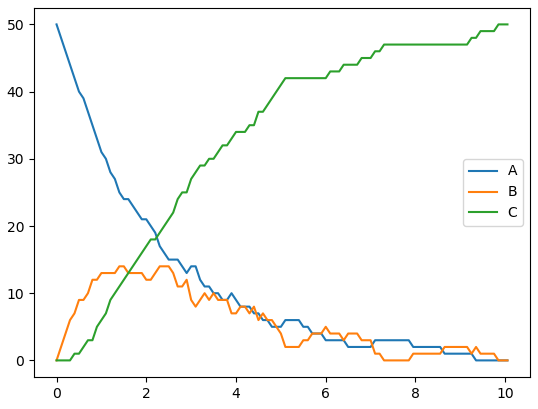

# Constraint-Based Simulation Algorithm (CBSA)

CBSA is a Python package for simulation of biochemical systems using the Constraint-Based Simulation Algorithm.


[](https://pypi.org/project/cbsa)


Table of contents
-----------------

* [Installation](#installation)
* [Usage](#usage)
* [License](#license)


Installation
------------

CBSA can be installed on your computer using pip.

Just run the following command:
```
python3 -m pip install cbsa --user --upgrade
```

Usage
-----

CBSA 

### Simple reaction example

Consider the following reaction system:


Using the Constrain-Based Modeling, the Stoichiometric matrix becomes:


A sample code to simulate this system is:


```python
from cbsa import ReactionSystem
import matplotlib.pyplot as plt
import numpy as np

S = [[-1, 1, 0],
     [ 1,-1,-1],
     [ 0, 0, 1]]

R = [[0,0,0],
     [0,0,0],
     [0,0,0]]

x0 = [50,0,0]
k = [0.5,0.1,0.8]
max_dt = 0.1
alpha=0.5
total_sim_time = 10

cbsa = ReactionSystem(S,R)

cbsa.setup()
cbsa.set_x(x0)
cbsa.set_k(k)

cbsa.setup_simulation(use_opencl=False,alpha=alpha,max_dt=max_dt)
cbsa.compute_simulation(total_sim_time)
cbsa_data = np.array(cbsa.simulation_data)

plt.plot(cbsa_data[:,0],cbsa_data[:,1],label="A")
plt.plot(cbsa_data[:,0],cbsa_data[:,2],label="B")
plt.plot(cbsa_data[:,0],cbsa_data[:,3],label="C")
plt.legend()
plt.show()
```




License
-------

CBSA is licensed under the MIT License.  Please see the file [LICENCE](LICENSE) for more information.


